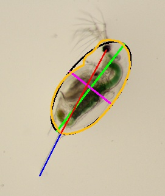

# The-Daphnia-ruler manual
## Contents
1. Introduction
	1a. Measured traits
2. Usage
	2a. The help menu
	2b. Input
## 1. Introduction
The Daphnia ruler is a command line program that allows the collection of 
morphometric data of zooplankton from still images. It was specifically
designed to collect accurate morphometric data of Daphnia using a
combination of edge detection methods and landmarking approaches. Although
the daphnia ruler was designed specifically for Daphnia it may also be
used to collect data for other zooplankton species.

### 1a. Measured traits


The following traits can be measured in all zooplankton species:
* body size: approximated by fitting an ellipse around the Daphnia body 
(green line)
* body area (area within red outline)
* body perimeter (length of red outline in image)
* body width (purple line in image)

For Daphnia additional features can be measured (for instructions see usage):
* body size: measured from the center of the eye to the base of the tail 
(red line)
* tail length (blue line)
* tail angle

## 2. Usage
The Daphnia ruler is simple to use and requires a maximum of four arguments.
Only one argument is mandatory which specifies the path to an input
directory (see 2b. Input). All other arguments are optional and will be
described in detail in the corresponding subsections. 

To use the daphnia ruler first install it and its dependencies
(instructions can be found in README.md). Once installed open your
command prompt and navigate into the cloned directory. Note that the
daphnia ruler only works when the working directory contains the following
files:
* daphnia_ruler.py
* measurement_methods.py

### 2a. The help menu
The help menu very briefly describes the usage of the daphnia ruler and
can be accessed using the -h flag. Your input should look like
this:
```bash
python daphnia_ruler.py -h
```
This command will show all possible arguments the daphnia ruler accepts
plus a short description of each argument.

### 2b. Input
The input path is specified using the -p flag.
Example:
```bash
python daphnia_ruler.py -p C:\Users\'Username'\input_directory
```
This command specified 'input_directory' as the input for the daphnia ruler.

**The input directory:**
The input directory can either be a directory containing images or a
directory containing subdirectories which contain images. Thus the daphnia
ruler will analyze all images in both the input directory and all its 
subdirectories.

**Images in input directory:**

**What image formats are accepted:**

A variaty of image formats are accepted by the daphnia ruler including jpeg, png,
and tiff. 

**What should an image look like:**
The image should preferably only contain a single zooplankton individual.
However, the daphnia ruler will collect morphometric data of the largest object
in the image. Thus it is possible to have smaller objects in the image as well
which will be ignored by the daphnia ruler. Note however, that objects should
not touch each other.
The daphnia ruler relies on edge detection algorithms. Even though these can
handle a certain amount of noise in the the image it is important to have 
a clear separation of the zooplankton indivdual and the background. A good 
way to achieve this is to photograph individuals on clean microscope slides.
As mentioned in the introduction additional features can be measured for 
Daphnia. In order to do so it is crucial that images are taken by means
of bright field photography.

### 2c. Output
The daphnia ruler will create a subfolder in each directory of the input 
that contains images. These subfolders will be named results and contain 
a copy of each image 
with results overplotted (unless argument -n is 
active; see 2....). This new subfolder will also include a single 
csv file containing all measurements for each image in the original
directory.