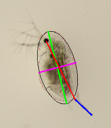

# The-Daphnia-ruler
Automatically collect morphometric traits of Daphnia.
<!-- badges: start -->
[](https://github.com/nelstevens/The-Daphnia-ruler/actions)
[](https://codecov.io/gh/nelstevens/The-Daphnia-ruler)
<!-- badges: end -->


## Overview
The Daphnia ruler is a command line program that can measure morphometric traits of Daphnia from images taken under a microscope. 
The Daphnia ruler works in windows, macOS and linux and can measure the following traits:
* body size: measured from the center of the eye to the base of the tail (red line in image)
* body size: approximated by fitting an ellipse around the Daphnia body (green line in image)
* tail length (blue line in image)
* tail angle
* body area (area within red outline in image)
* body perimeter (length of red outline in image)
* body width (purple line in image)

The Daphnia ruler can also be used as a python package allowing the user to access more functionality. For more information see tbd.


## Installation
The fastest way to get your system setup is to make sure you've installed [python 3](https://www.python.org/) and the package installer [pip](https://pypi.org/project/pip/). Then run:\
```
python3 -m pip install -i https://test.pypi.org/simple/ daphruler
```

## Usage
For detailed information on how to use the Daphnia ruler see Manual.md. For quick help on CLI usage run:
```
python3 -m daphruler -h
```

```bash
usage: python3 -m daphruler [-h] -p PATH [-n] [-e] [-s]

optional arguments:
  -h, --help            show this help message and exit
  -n, --noImages        Don't write images with results overplotted.
  -e, --eyeMethod       Implement eye method on top of ellipse method.
  -s, --scaleMM         Scale measurement to mm. For more information see README.md

required named arguments:
  -p PATH, --path PATH  Path to your input directory. The program is able to loop through subdirectories of the input.
```

## Contributions
Collaborators are always welcome. Feel free to write pull requests or contact nelson.stevens92@gmail.com for further information.

## Author
* Nelson Stevens
* Contact: nelson.stevens92@gmail.com
